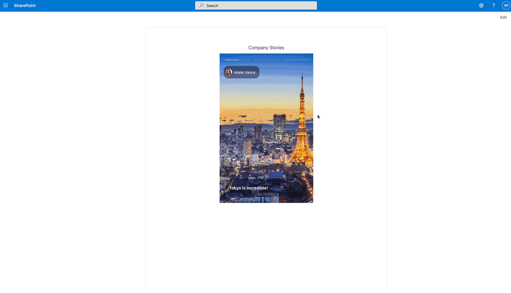

# sp-insta-stories

## Summary

This webpart pulls images from a SharePoint list and renders them similar to stories on Instagram. Use this webpart to provide an engaging image showcase on your SharePoint site.



## Used SharePoint Framework Version


## Compatibility


## Applies to

- [SharePoint Framework](https://aka.ms/spfx)
- [Microsoft 365 tenant](https://docs.microsoft.com/en-us/sharepoint/dev/spfx/set-up-your-developer-tenant)

> Get your own free development tenant by subscribing to [Microsoft 365 developer program](http://aka.ms/o365devprogram)

## Prerequisites

- This solution uses Yarn. Either install yarn globally via npm or delete yarn.lock file.
- Before deploying you should create a compatible list on the destination SharePoint site. Use the following fields:  
  - Title: Single line of text (default)  
  - Content: Single or multiline text  
  - Image: Image field type  
  - Author: Person field type  
  - Active: Yes/No field type  
- Permission _User.ReadBasic.All_ to the Graph API

## Solution

| Solution    | Author(s)                                               |
| ----------- | ------------------------------------------------------- |
| sp-insta-stories | [MRS Company Ltd](https://mrscompany.com)

## Version history

| Version | Date             | Comments        |
| ------- | ---------------- | --------------- |
| 1.0    | November 4, 2022   | Initial release  |

## Disclaimer

**THIS CODE IS PROVIDED _AS IS_ WITHOUT WARRANTY OF ANY KIND, EITHER EXPRESS OR IMPLIED, INCLUDING ANY IMPLIED WARRANTIES OF FITNESS FOR A PARTICULAR PURPOSE, MERCHANTABILITY, OR NON-INFRINGEMENT.**

---

## Minimal Path to Awesome

```bash
git clone {repo url} # Clone repo
cd sp-insta-stories # Change directory to project folder
yarn # Install dependencies
gulp serve # Serve in dev. Remember to change your dev environment in config/serve.json
gulp build # Build solution
gulp bundle --ship # Bundle for prod
gulp package-solution --ship # Create .sppkg file
```

Then upload the sharepoint/sp-insta-stories.sppkg file to your App Catalog and deploy.

## Features

This extension illustrates the following concepts:

- Using @pnp/sp to pull data from SharePoint API
- Using @pnp/graph to pull User information from Microsoft Graph
- Using FluentUI components

## References

- [Inspired by this great work from Luis Mañez in the PnP sample repo](https://github.com/pnp/sp-dev-fx-webparts/tree/main/samples/react-company-stories)
- [Getting started with SharePoint Framework](https://docs.microsoft.com/en-us/sharepoint/dev/spfx/set-up-your-developer-tenant)
- [Building for Microsoft teams](https://docs.microsoft.com/en-us/sharepoint/dev/spfx/build-for-teams-overview)
- [Use Microsoft Graph in your solution](https://docs.microsoft.com/en-us/sharepoint/dev/spfx/web-parts/get-started/using-microsoft-graph-apis)
- [Publish SharePoint Framework applications to the Marketplace](https://docs.microsoft.com/en-us/sharepoint/dev/spfx/publish-to-marketplace-overview)
- [Microsoft 365 Patterns and Practices](https://aka.ms/m365pnp) - Guidance, tooling, samples and open-source controls for your Microsoft 365 development
